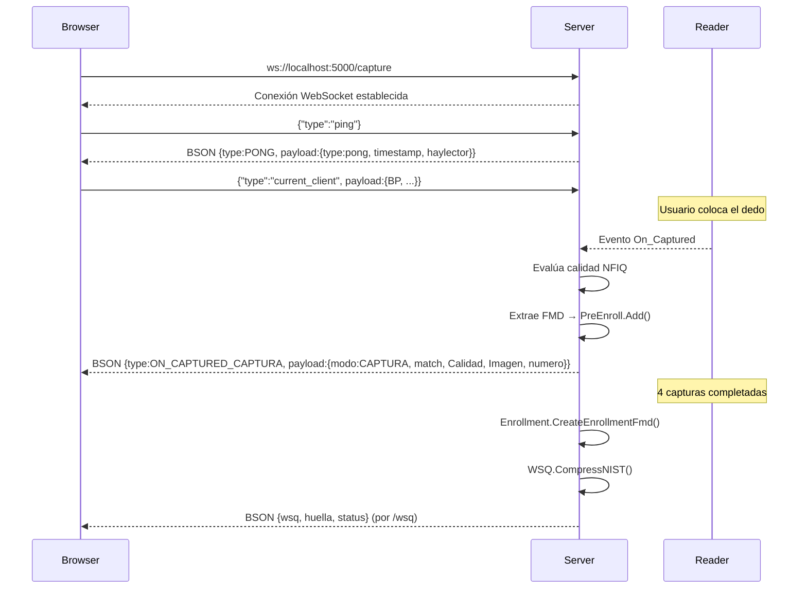
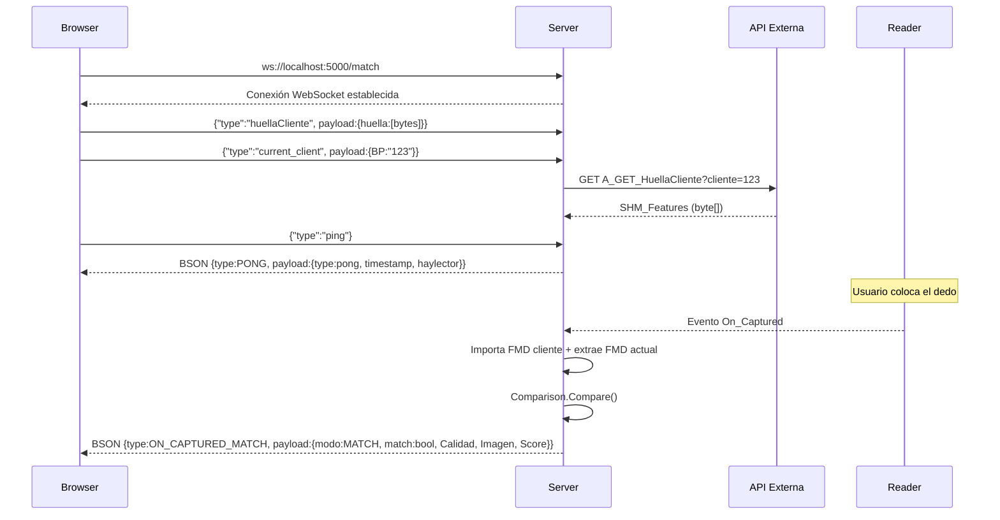
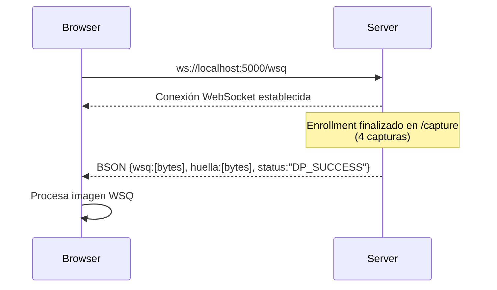

# FingerprintReaderApp

Sistema de captura y verificación de huellas dactilares con DigitalPersona U.are.U, compuesto por un servidor WebSocket en C# .NET 9 y un frontend Vue 3.

## Estructura del proyecto

```
FingerprintReaderApp/
├── AdaptadorHuella1/                    # Servidor WebSocket (ASP.NET Core 9)
│   ├── Program.cs                       # Entry point, endpoints WebSocket
│   ├── Adaptador.cs                     # Lógica de huellas: calidad NFIQ, comparación, bitmap
│   ├── WebSocketExtension.cs            # Extensión para envío BSON por WebSocket
│   ├── WSQ.cs                           # Compresión/descompresión WSQ (P/Invoke dpfj.dll)
│   ├── NFIQ.cs                          # Puntaje de calidad NFIQ (P/Invoke dpfj.dll)
│   ├── ApiClient.cs                     # Cliente REST a API externa (biometrico-api.mavi.fun)
│   ├── appsettings.json                 # Configuración ASP.NET
│   ├── lib/DPUruNet.dll                 # SDK de DigitalPersona
│   └── Handlers/
│       ├── IFingerprintHandler.cs       # Interfaz de handler
│       ├── CaptureHandler.cs            # Captura para enrolamiento (4 muestras)
│       └── MatchHandler.cs              # Verificación contra huella almacenada
├── AdaptadorHuella2/                    # Cliente WinForms legacy (.NET 4.7.2)
│   ├── Program.cs
│   ├── Form1.cs                         # UI que muestra imagen de huella vía WebSocket
│   └── packages.config
└── FingerprintReaderApp/                # Frontend Vue 3 + Vite
    ├── src/
    │   ├── main.js
    │   ├── App.vue
    │   └── components/
    │       ├── LectorHuella.vue         # Conexión WebSocket, captura y match
    │       └── HuellaMatch.vue          # Layout tipo diálogo
    ├── index.html
    └── package.json
```

## Descripción de archivos importantes

### `AdaptadorHuella1/Program.cs`
Punto de entrada del servidor. Crea una aplicación ASP.NET Core que:
- Configura **Serilog** para logging estructurado con salida a consola.
- Inicializa lectores **DigitalPersona U.are.U** vía `DPUruNet.dll` en modo exclusivo, con sondeo cada 3s para detectar conexión/desconexión.
- Expone **tres endpoints WebSocket** en `http://localhost:5000`:
  - `/capture` — captura para enrolamiento (acumula hasta 4 muestras y genera FMD + WSQ).
  - `/match` — verificación: compara huella capturada contra una referencia.
  - `/wsq` — recibe los datos WSQ comprimidos al finalizar enrolamiento.
- Maneja mensajes `ping` → responde `pong` con timestamp y estado del lector.
- Gestiona `current_client` para asociar la captura a un cliente.
- Al capturar, evalúa calidad NFIQ (1=EXCELENTE, 2=BUENA, otro=MALA) y rutea a `CaptureHandler` o `MatchHandler`.
- Limpieza graceful en shutdown (SIGTERM, Ctrl+C, ProcessExit).

### `AdaptadorHuella1/Adaptador.cs`
Núcleo de la lógica biométrica:
- `ActionClient` enum: `ON_CAPTURED_MATCH`, `ON_CAPTURED_CAPTURA`, `SYNC_ESTADO`, `PONG`.
- `Adaptador.HayLector()` — verifica si hay lectores conectados.
- `Adaptador.CreateBitmap()` — convierte raw bytes de huella (escala de grises) a JPEG usando **SixLabors.ImageSharp**.
- `Adaptador.ToDB()` — extrae características FMD y evalúa calidad NFIQ.
- `Adaptador.ExisteHuellaSimilar()` — compara huella capturada contra FMD almacenado.
- `ResponseBody` — DTO de respuesta con `modo`, `match`, `Calidad`, `Lectura`, `Imagen`, `numero`, `Score`.
- `PreEnroll` — buffer circular de 4 FMDs para enrolamiento.

### `AdaptadorHuella1/WebSocketExtension.cs`
Extensión `sendBytesAsync(this WebSocket, ActionClient, dynamic)` que serializa el payload como **BSON binario** (tipo + payload) y lo envía por WebSocket.

### `AdaptadorHuella1/WSQ.cs`
Wrapper P/Invoke sobre `dpfj.dll` para compresión WSQ (NIST y AWARE) y descompresión.

### `AdaptadorHuella1/NFIQ.cs`
Wrapper P/Invoke para obtener puntaje NFIQ (NIST Fingerprint Image Quality) desde un FID.

### `AdaptadorHuella1/ApiClient.cs`
Cliente REST que obtiene la huella almacenada de un cliente desde `https://biometrico-api.mavi.fun/A_GET_HuellaCliente?cliente={BP}`.

### `AdaptadorHuella1/Handlers/CaptureHandler.cs`
Maneja la captura para enrolamiento:
- Extrae FMD en formato `DP_PRE_REGISTRATION` y lo agrega al buffer `PreEnroll`.
- Después de 4 capturas exitosas, genera el FMD de enrolamiento (`Enrollment.CreateEnrollmentFmd`) y comprime la imagen a WSQ.
- Envía los datos WSQ al cliente conectado en `/wsq`.

### `AdaptadorHuella1/Handlers/MatchHandler.cs`
Maneja la verificación:
- Importa el FMD almacenado del cliente (`Importer.ImportFmd`).
- Extrae FMD de la captura actual (`FeatureExtraction.CreateFmdFromFid`).
- Compara con `Comparison.Compare` — si `Score < 500` se considera match exitoso.

## Diagramas de secuencia

Los mensajes se serializan en **BSON binario** con estructura `{type, payload}`. El cliente puede enviar JSON en texto plano.

### Endpoint `/capture`



### Endpoint `/match`



### Endpoint `/wsq`



## Tecnologías

| Componente | Tecnología |
|---|---|
| Servidor | C# .NET 9 ASP.NET Core, WebSocket, BSON |
| SDK Huellas | DigitalPersona DPUruNet.dll + dpfj.dll |
| Logging | Serilog |
| Imágenes | SixLabors.ImageSharp |
| Cliente REST | RestSharp |
| Frontend | Vue 3 + Vite |
| Cliente legacy | .NET Framework 4.7.2 WinForms + Fleck |
